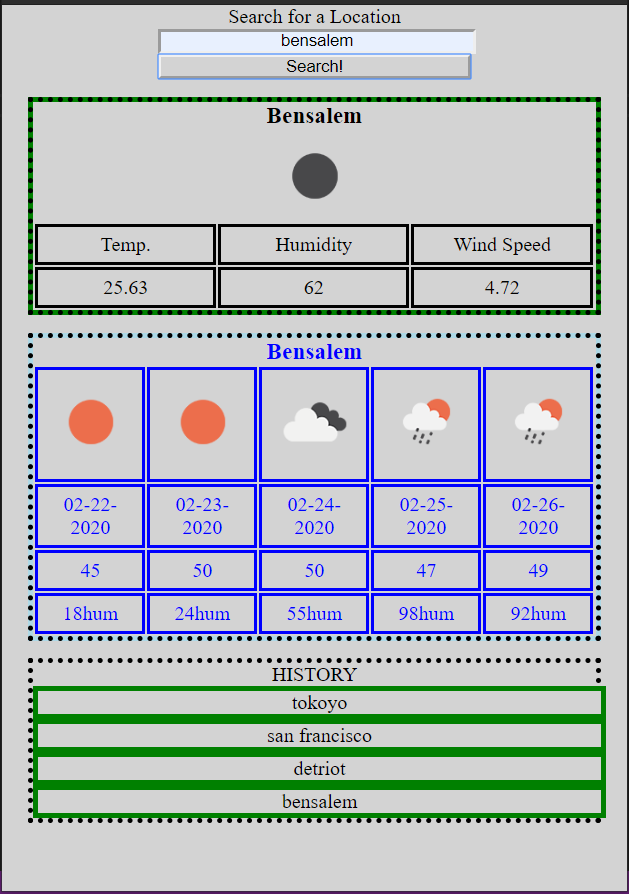

# Weather Dashboard [Deployed Webpage](https://antonio36alv.github.io/weather-dashboard/) [Repo Link](https://github.com/antonio36alv/weather-dashboard)

## Project Description
--------------------------------------------------
This purpose of this project was to demostarte the ability to grab data from the [OWM API](https://openweathermap.org/api) and display it on my own website.

### Project Specifications

Click: [Project Specifications README.md](project_specs/README.md)

